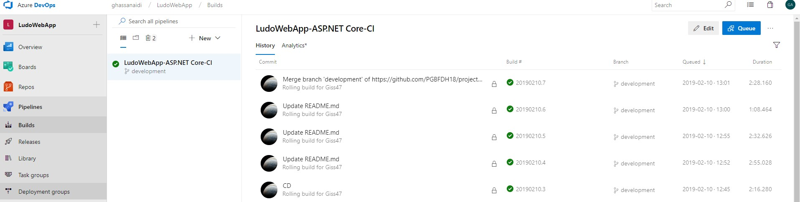
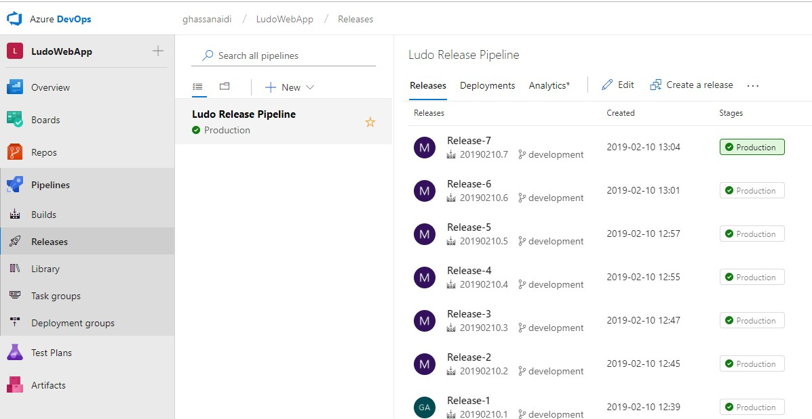

# Configuring CI and CD with Azure

### Azure Account
A student account was created on Azure with allow the use of CD services. 
A build pipeline was configured early in development with CI trigger. 

### Publishing the project 
The app was published to Azure web service using Visual Studio. By creating a new Resource Group, GbgTeknik, then added a service plan. 

### DevOps

Later on we configured the release pipeline which was set to trigger CD on every new commit on Git. 

Link for the Application on Azure
[https://ludogameapp.azurewebsites.net/](https://ludogameapp.azurewebsites.net/) 

---
screen shots

