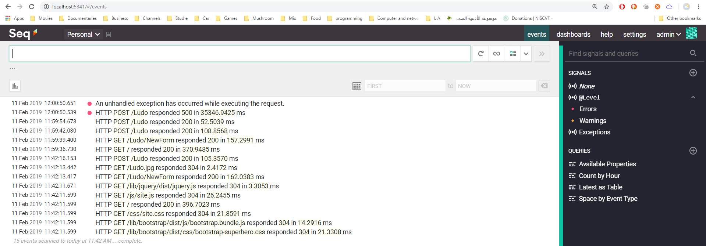

# Logging Implementation

## Serilog

We chose to implement at 3rd party Middleware through adding a Nuget package and configuring it in our source code, Startup.cs and Program.cs. 

Link to the service:
[https://blog.getseq.net/smart-logging-middleware-for-asp-net-core/](https://blog.getseq.net/smart-logging-middleware-for-asp-net-core/)   

## Seq

As any logging facility the logs should be written out to a destination, console, database. 
The Serilog service has a good sink, **Seq**. 
We have download it locally and took a screen shot for it in action. 

The configuration lays in the program.cs file. 