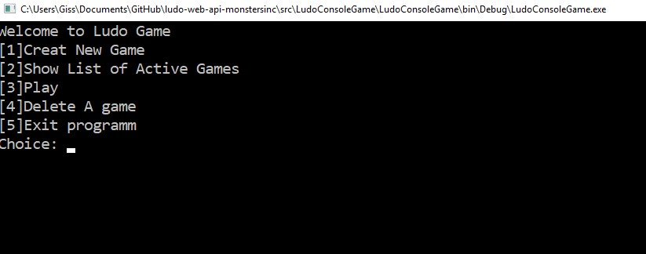

## Console Application
The application is written with C# code to communicate with a LudoGameAPI using a Nuget Package, Restsharp. 

### RestSharp
The client sends out HTTP requests to the API and receives back the responses. For this purpose the application has a class which is solely responsible for sending request to the API.  

### Newtonsoft.Json
Is another NuGet package that facilitate the parsing of JSON received data from the API into .Net types. Several classes are created with properties that has attributes provided by ***Newtonsoft.Json*** package to use this feature. 

### Main Program 
In the program file all main logic that displayed the user is written. 

